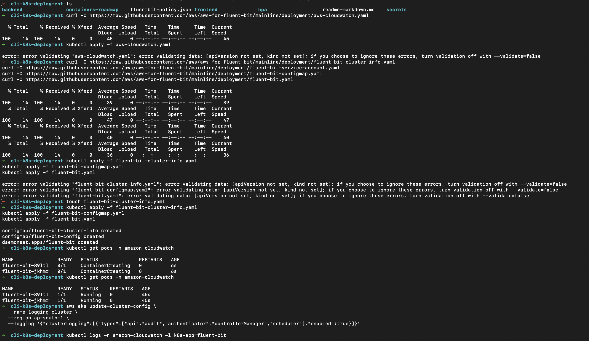
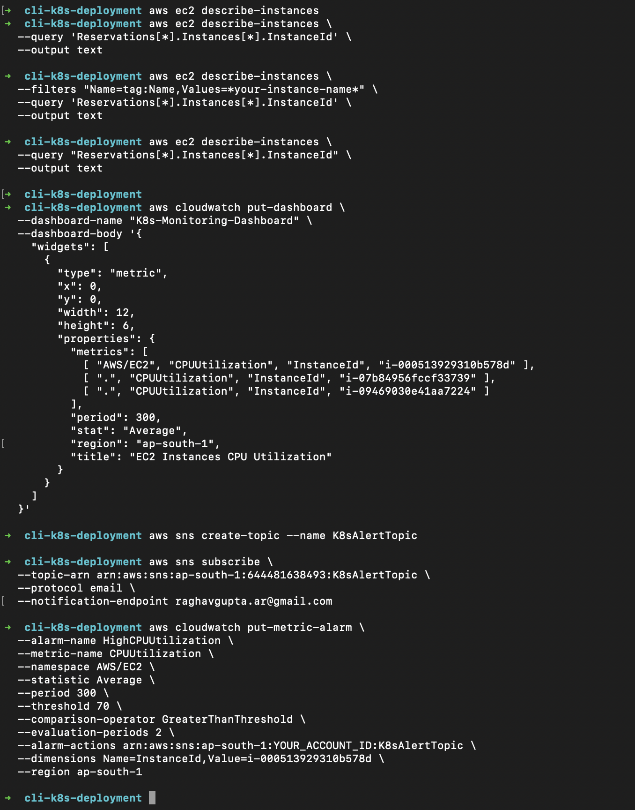
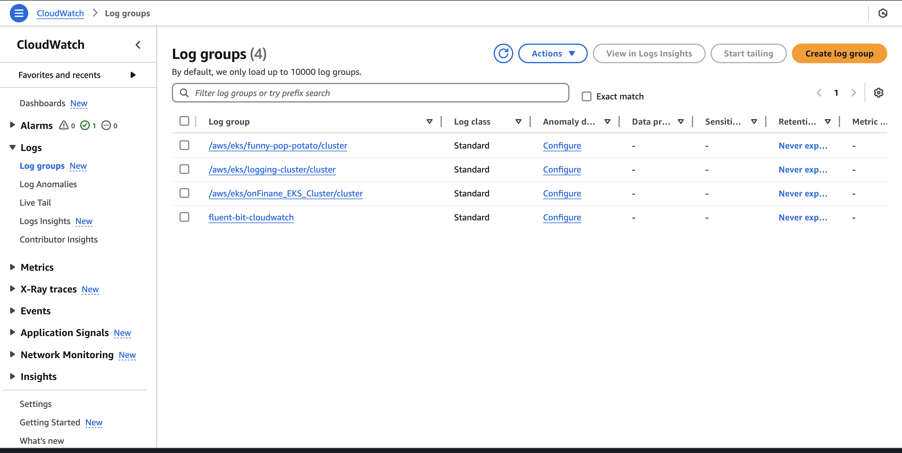
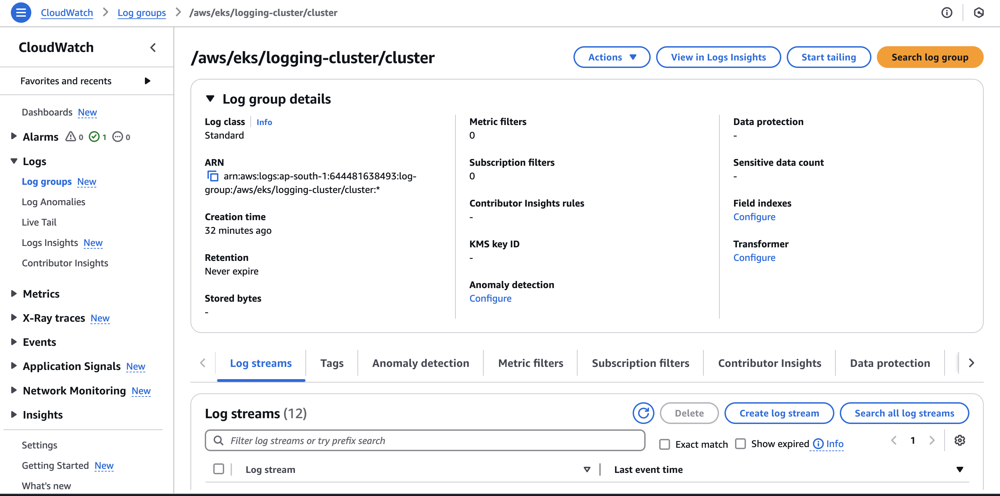
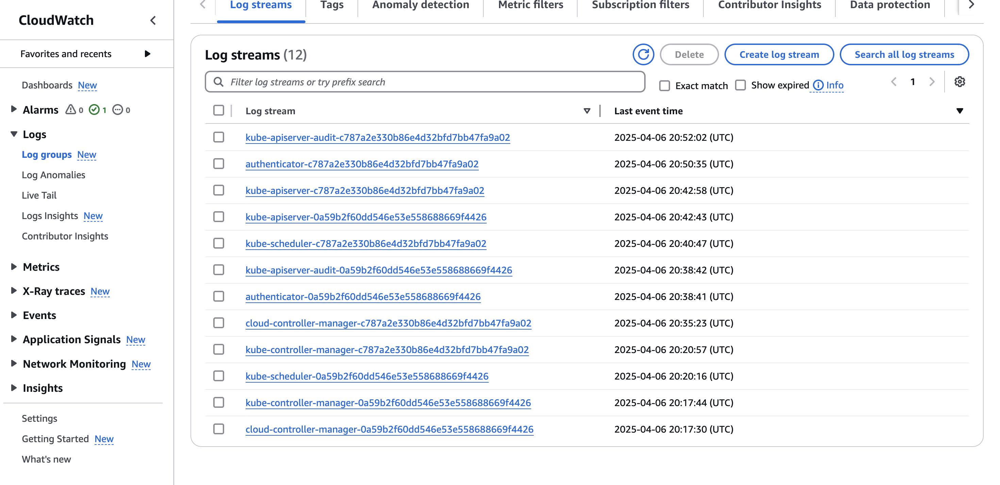
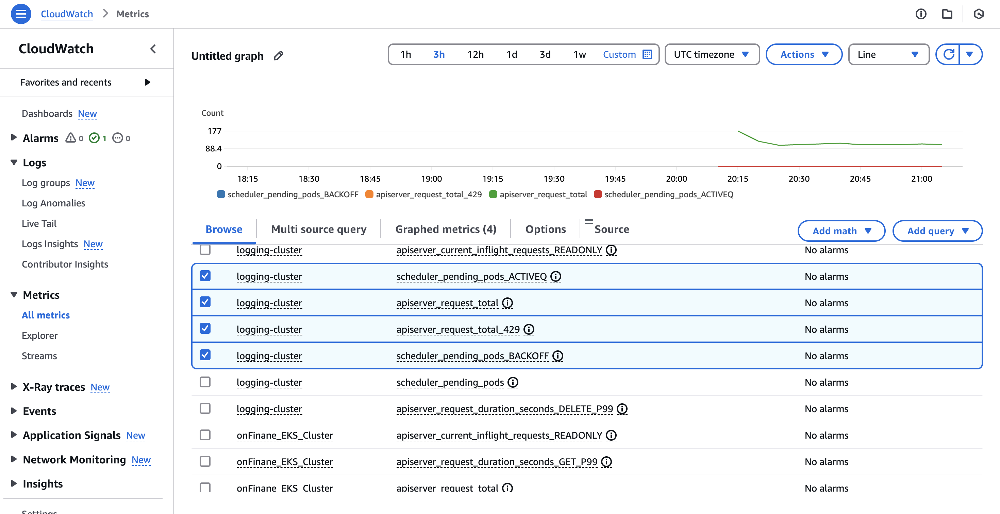

# Stage 3 🚀 Kubernetes Deployment on AWS EKS

This project demonstrates deploying a sample **frontend-backend** application to a Kubernetes cluster hosted on **Amazon EKS**, following best practices for scalability, high availability, and configuration management.

---

## 📁 Project Structure

```
cli-k8s-deployment/
├── backend/
│   ├── deployment.yaml
│   ├── service.yaml
│   ├── configmap.yaml
│   ├── secret.yaml
│   └── hpa.yaml
├── frontend/
│   ├── deployment.yaml
│   ├── service.yaml
│   ├── configmap.yaml
│   ├── secret.yaml
├── README.md
```

---

## 🛠️ Prerequisites

```bash
# Make sure you have the following installed and configured:
- AWS CLI (configured)
- kubectl
- eksctl
```

## ☁️ Step 1: Create the EKS Cluster

```bash
eksctl create cluster \
--name demo-cluster \
--version 1.31 \
--region ap-south-1 \
--nodegroup-name standard-workers \
--node-type t3.medium \
--nodes 2 \
--nodes-min 1 \
--nodes-max 3 \
--managed
```

## 🧱 Step 2: Namespaces

```bash
kubectl create namespace backend
kubectl create namespace frontend
```

## ⚙️ Step 3: Configuration Management

### Backend ConfigMap & Secret

```yaml
# backend/configmap.yaml
apiVersion: v1
kind: ConfigMap
metadata:
  name: backend-config
  namespace: backend
data:
  DB_HOST: "db.internal"
  LOG_LEVEL: "debug"
```

```yaml
# backend/secret.yaml
apiVersion: v1
kind: Secret
metadata:
  name: backend-secret
  namespace: backend
type: Opaque
data:
  DB_USER: dXNlcm5hbWU=        # "username" base64
  DB_PASSWORD: cGFzc3dvcmQ=    # "password" base64
```

### Frontend ConfigMap & Secret

```yaml
# frontend/configmap.yaml
apiVersion: v1
kind: ConfigMap
metadata:
  name: frontend-config
  namespace: frontend
data:
  API_URL: "http://backend-service.backend.svc.cluster.local"
```

```yaml
# frontend/secret.yaml
apiVersion: v1
kind: Secret
metadata:
  name: frontend-secret
  namespace: frontend
type: Opaque
data:
  API_KEY: c2VjcmV0S2V5       # "secretKey" base64
```

```bash
# Apply configs
kubectl apply -f backend/configmap.yaml
kubectl apply -f backend/secret.yaml
kubectl apply -f frontend/configmap.yaml
kubectl apply -f frontend/secret.yaml
```

## 🚀 Step 4: Deployments

```yaml
# Key Features of Deployments:
# - envFrom to load ConfigMap and Secret
# - Liveness & Readiness Probes
# - Resource Limits for CPU and Memory
# - 2 Replicas for High Availability
```

```bash
kubectl apply -f backend/deployment.yaml
kubectl apply -f backend/service.yaml
kubectl apply -f frontend/deployment.yaml
kubectl apply -f frontend/service.yaml
```

## 🌐 Step 5: Service Exposure

```yaml
# Backend:
# - ClusterIP (internal communication)

# Frontend:
# - LoadBalancer (public exposure)
```

```bash
kubectl get svc -n frontend
```
Use the EXTERNAL-IP in your browser or with curl.

## 📈 Step 6: Auto-Scaling

```yaml
# backend/hpa.yaml
apiVersion: autoscaling/v2
kind: HorizontalPodAutoscaler
metadata:
  name: backend-hpa
  namespace: backend
spec:
  scaleTargetRef:
    apiVersion: apps/v1
    kind: Deployment
    name: backend-api
  minReplicas: 2
  maxReplicas: 5
  metrics:
    - type: Resource
      resource:
        name: cpu
        target:
          type: Utilization
          averageUtilization: 50
```

```bash
kubectl apply -f backend/hpa.yaml
```

## ✅ Verification Commands

```bash
kubectl get pods -A
kubectl get svc -A
kubectl get hpa -n backend
kubectl logs <pod-name> -n backend
```

## 🧪 Health Checks

```yaml
# Example of liveness and readiness probes
livenessProbe:
  httpGet:
    path: /health
    port: 80
  initialDelaySeconds: 10
  periodSeconds: 5

readinessProbe:
  httpGet:
    path: /ready
    port: 80
  initialDelaySeconds: 5
  periodSeconds: 3
```

## 📦 Resource Limits

```yaml
resources:
  requests:
    cpu: "100m"
    memory: "128Mi"
  limits:
    cpu: "500m"
    memory: "256Mi"
```

## 🔚 Cleanup

```bash
eksctl delete cluster --name demo-cluster --region ap-south-1
```

## 🏁 Summary

| Feature                     | Implemented |
|----------------------------|-------------|
| Deployments                | ✅          |
| Multi-replica HA           | ✅          |
| Services                   | ✅          |
| LoadBalancer Exposure      | ✅          |
| ConfigMap/Secrets          | ✅          |
| Liveness/Readiness Probes  | ✅          |
| HPA (Auto-scaling)         | ✅          |
| Resource Limits            | ✅          |


# Stage 4: Logging, Monitoring, and Alerting

## 🔧 Logging Implementation

- **Tool Used:** Fluent Bit
- **Log Destination:** Amazon CloudWatch Logs
- **Deployment:** Deployed Fluent Bit as a DaemonSet across all nodes
- **Centralized Logging:** Application and container logs are available in CloudWatch grouped by pod


## 📊 Monitoring Setup

- **Tool Used:** Metrics Server for Kubernetes + AWS CloudWatch
- **Deployment:** Installed via `kubectl apply`
- **Metrics Tracked:** CPUUtilization of EC2 instances running the cluster
- **Dashboard:** Custom CloudWatch dashboard created via AWS CLI

## 🔔 Alerting Implementation

- **SNS Topic:** Created topic `K8sAlertTopic`
- **Subscription:** Email subscription (confirmed)
- **CloudWatch Alarm:** 
  - Metric: CPUUtilization (EC2)
  - Trigger: When average CPU usage exceeds 70% for 10 minutes
  - Action: Sends notification to the SNS topic

## 🛡️ Reliability Measures

- **Kubernetes Self-Healing:** Ensured via deployments and readiness probes
- **Multi-AZ Deployment:** All EC2 instances span across multiple availability zones (verified via AWS Console)

## 📎 Relevant SS






